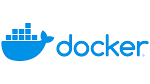
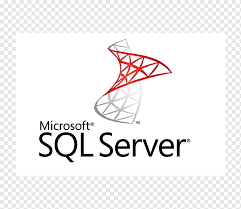
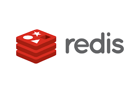

## 

## Personal Info
 - Focus                        : Backend Development
 - Total years of experience    : 10
 - Spoken Languages             : Turkish (native), English (B2 Level)
 - Education                    : Computer Engineer Bachelor’s Degree
 - Current Company		            : <a href="http://www.deliveryhero.com">Delivery Hero</a>

## My Skill Set  
<table><tr><td valign="top" width="33%">

### Backend  

  

</td><td valign="top" width="33%">

### Infra  

  

</td><td valign="top" width="33%">

### Database  

  

 

</td></tr></table>  

 
